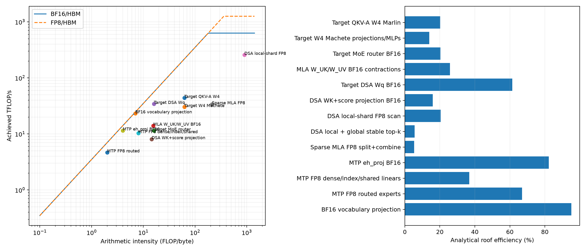

# C4 DCP4 decode: kernel and roofline analysis

## Result in one paragraph

The true concurrency-4 trace is `generation_4(16)`: four sequences, 16 target
verification tokens, then three MTP draft passes of four tokens each. Dense
weights amortize well: target Machete time is 3.70 ms, essentially unchanged
from c1 despite 4x the target tokens, and sparse MLA does 4x useful work in
1.37x the time. The step is instead set by routed MoE and synchronization.
Routed W4 expert kernels contribute 32.00 ms of cumulative activity and reduce
to a 19.17 ms hot/cold-overlapped span; TP custom all-reduce contributes
13.27 ms, and the DCP attention/index communication chain contributes another
9.17 ms including correction. Most collectives are short, but a few
shape-boundary calls wait for 0.6-2.4 ms and expose rank skew. This is a
latency/synchronization roof, not an NVLink bandwidth roof.

The benchmark surrounding the trace measured a 68.43 ms steady step p50,
160.61 aggregate tok/s (40.15 per request), and 2.883 accepted tokens per
engine step. PyTorch profiling inflated the six measured start-to-start cycles
to 76.65 ms, so benchmark latency is authoritative while trace durations are
used for attribution.



## What was measured

- Job 976646, one JUPITER Booster node, four GH200 GPUs, TP4/EP4/DCP4, `ag_rs`,
  MTP3, tiered W4 MoE, 399,744 context tokens per sequence.
- Eight full-context c4 decode steps were captured on all four ranks; the six
  inner start-to-start cycles exclude profiler boundaries.
- Durations and call counts are measured CUDA events. FLOPs and logical bytes
  are analytical, from model geometry and kernel contracts; this trace has no
  CUPTI performance counters.
- Conservative project ceilings: 3.5 TB/s HBM, 421 GB/s Grace C2C, 150 GB/s
  one-direction peer NVLink, 630 TFLOP/s BF16, and 1,260 TFLOP/s FP8.
- “Roof efficiency” is useful FLOPs divided by `min(compute roof, AI x bandwidth
  roof)`. The top-k row instead uses a minimum-byte bandwidth bound.

## One engine step

```text
target verification: 4 sequences x 4 tokens = q16
  78 transformer layers
    QKV-A W4
    on 21 index layers:
      BF16 index projections -> rank-local FP8 scan of ~100K cache tokens
      -> local top-k -> pack -> candidate all-gather -> stable global top-k
    MLA contractions -> query all-gather (16 local -> 64 heads)
      -> rank-local FlashMLA over ~512 owned candidates
      -> LSE all-gather -> LSE correction -> reduce-scatter
    dense/shared W4, or on 75 routed layers:
      BF16 router -> hot HBM experts || cold Grace/C2C experts
      -> activation/sum -> TP custom all-reduce
  BF16 vocabulary projection -> vocabulary all-gather

three MTP draft passes: q4 each
  FP8 draft linears/experts + one sparse-attention layer + vocabulary head
  -> acceptance
```

There is no storage or network I/O in decode. Persistent weights and caches
come from HBM; cold expert weights arrive from the NUMA-local Grace memory over
NVLink-C2C; TP/DCP tensors move peer-to-peer over GPU NVLink. Explicit CUDA
copies are only 0.063 ms of activity per step.

## Timeline

| Metric | c4 trace | c1 reference | Interpretation |
| --- | ---: | ---: | --- |
| Profiled start-to-start cycle | 76.65 ms | 52.66 ms | profiler-instrumented |
| Target annotation | 55.50 ms | 34.68 ms | q16 versus q4 |
| Three draft passes + tail | 21.15 ms | 17.99 ms | q4 versus q1 |
| Union GPU busy | 59.70 ms | 37.92 ms | overlapping kernels counted once |
| Cumulative CUDA activity | 77.13 ms | 44.02 ms | streams overlap; do not sum to wall |
| Idle inside cycle | 16.95 ms | 14.74 ms | dependencies and rank waits |
| Kernel/copy graph nodes | 4,861 | 4,809 | batching adds work, not many nodes |
| Busy time at overlap depth >=2 | 29.1% | 16.0% | mainly hot/cold MoE overlap |

Rank wall times agree within 0.26 ms, as they must at collective boundaries,
but rank-local busy time ranges from 48.08 to 66.47 ms and idle from 10.19 to
28.69 ms. Faster ranks repeatedly reach collectives early and wait. The mean
idle gap is 4.59 us (p50 0.51 us, p99 106.62 us, maximum 946.35 us).

## Where CUDA activity goes

Activity is averaged over ranks and six cycles. It includes time spent waiting
inside collective kernels and therefore is not additive to wall time.

| Family | Calls/step | Activity | c4/c1 time | What it does |
| --- | ---: | ---: | ---: | --- |
| Routed W4 Marlin experts | 300 | 32.00 ms | 3.43x | target hot and cold experts |
| TP custom all-reduce | 166 | 13.27 ms | 1.48x | residual/MLP TP reductions |
| Routed MoE support | 678 | 5.09 ms | 1.83x | align, sort, activation, sum |
| Target W4 Machete | 312 | 3.70 ms | 0.97x | dense/shared projections and MLPs |
| DCP query all-gather | 81 | 2.70 ms | 1.20x | assemble 64 MLA heads |
| DCP LSE all-gather | 81 | 2.75 ms | 1.15x | cross-shard softmax metadata |
| Sparse MLA split + combine | 162 | 2.66 ms | 1.37x | local sparse attention |
| DCP candidate all-gather | 24 | 1.78 ms | 1.19x | merge DSA top-k candidates |
| DCP reduce-scatter | 81 | 1.78 ms | 1.30x | return corrected MLA outputs |
| Vocabulary all-gather | 4 | 1.43 ms | 1.08x | assemble logits |
| DSA local FP8 scan | 28 | 1.10 ms | 3.63x | 4x queries over context/4 |
| Target QKV-A W4 | 78 | 0.92 ms | 1.05x | weight-dominated projection |
| DSA local/global top-k | 48 | 0.83 ms | 1.27x | selection and stable merge |
| MLA/DSA BF16 GEMMs | 186 | 0.78 ms | 0.95x | contractions and index projections |
| MTP FP8 block | 60 | 0.66 ms | 1.38x | draft dense/routed kernels |
| Vocabulary GEMM | 4 | 0.57 ms | 0.97x | target and draft logits |
| Router BF16 GEMM | 75 | 0.33 ms | 1.24x | q16 split-K router |
| Other metadata/elementwise/copies | ~2,490 | 4.64 ms | — | graph glue and cache metadata |

The largest batching win is the dense path: 4x target FLOPs for nearly flat
Machete, QKV, contraction, and vocabulary time. Sparse MLA similarly turns 4x
useful work into only 1.37x time. Routed MoE cannot reuse weights as completely
because more tokens activate more distinct experts, so its overlapped union
span grows from 6.02 to 19.17 ms.

## Analytical kernel roofline

| Kernel group | Time | AI (F/B) | Achieved | Roof efficiency | Reading |
| --- | ---: | ---: | ---: | ---: | --- |
| QKV-A W4 Marlin | 0.917 ms | 62.1 | 43.9 TF/s | 20.2% | memory roof, underfilled |
| W4 Machete projections/MLPs | 3.698 ms | 62.1 | 30.2 TF/s | 13.9% | largest dense opportunity |
| BF16 MoE router | 0.331 ms | 16.0 | 11.4 TF/s | 20.4% | small split-K GEMMs |
| MLA W_UK/W_UV contractions | 0.693 ms | 15.6 | 14.1 TF/s | 25.8% | bandwidth/launch limited |
| DSA Wq BF16 | 0.164 ms | 16.0 | 34.4 TF/s | 61.4% | healthy small GEMM |
| DSA WK/score BF16 | 0.085 ms | 14.5 | 8.1 TF/s | 15.9% | very small GEMMs |
| DSA local FP8 scan | 1.104 ms | 899.9 | 258.2 TF/s | 20.5% | now compute-roofed |
| DSA local + stable top-k | 0.828 ms | — | 196 GB/s min. | 5.59% | selection/sync, not bulk bytes |
| Sparse MLA FP8 | 2.656 ms | 212.3 | 33.8 TF/s | 5.37% useful | irregular sparse gather |
| MTP `eh_proj` BF16 | 0.157 ms | 4.0 | 11.5 TF/s | 82.2% | near bandwidth roof |
| MTP FP8 dense/index/shared | 0.157 ms | 8.0 | 10.3 TF/s | 36.9% | weight amortized at q4 |
| MTP FP8 routed experts | 0.387 ms | 2.0 | 4.7 TF/s | 67.0% | strong bandwidth use |
| BF16 vocabulary projection | 0.571 ms | 7.0 | 23.3 TF/s | 95.2% | essentially at HBM roof |

Sparse MLA efficiency counts useful rank-owned work: about 512 candidates per
query. DCP compacts them into the prefix of a fixed 2,048-entry row and leaves
an `-1` tail that FlashMLA skips. The kernel still pays fixed index/scheduling
overhead, but it does not perform four times the useful attention math. Its low
roof position reflects irregular KV gathers, sparse scheduling, and a small
per-layer launch, not HBM saturation.

For routed target MoE, the trace directly measures 17.38 ms hot-HBM kernel time
and 14.62 ms cold-C2C kernel time. Their serial 32.00 ms becomes 19.17 ms via
overlap, saving 12.83 ms (40.1%). An assignment-equivalent traffic envelope is
67-74% of the HBM roof and 24-100% of C2C. This is deliberately a range:
multiple q16 tokens can select the same physical expert, so the trace does not
uniquely reveal physical weight bytes without routing IDs or memory counters.

## Communication roof

| Operation | Calls | Logical remote payload/rank | Activity | Effective link BW | 150 GB/s efficiency |
| --- | ---: | ---: | ---: | ---: | ---: |
| DCP query all-gather | 81 | 33.22 MiB | 2.697 ms | 12.92 GB/s | 8.61% |
| DCP LSE all-gather | 81 | 0.92 MiB | 2.747 ms | 0.35 GB/s | 0.235% |
| DCP candidate all-gather | 24 | 16.31 MiB | 1.780 ms | 9.61 GB/s | 6.41% |
| DCP reduce-scatter | 81 | 59.06 MiB | 1.780 ms | 34.79 GB/s | 23.19% |
| TP custom all-reduce | 166 | 89.58 MiB | 13.269 ms | 7.08 GB/s | 4.72% |
| Vocabulary all-gather | 4 | 6.20 MiB | 1.428 ms | 4.56 GB/s | 3.04% |

The DCP query/LSE/candidate/RS/correction chain is 9.17 ms of cumulative
activity. Its very low effective bandwidth, especially the 0.92 MiB split over
81 LSE collectives, shows that launch latency and barriers dominate. Likewise,
the 160 common TP all-reduces have a 6.85 us p50 but a 405 us p99; six boundary
all-reduces reach a 2.38 ms p99. A few draft/vocabulary/DCP boundary collectives
also take 0.6-1.5 ms. Those tails are rank-arrival waits, not payload transfer
time, and explain why rank 0 can be idle for 28.7 ms while all ranks finish the
same wall-time step.

## Optimization order implied by the trace

1. Reduce routed-MoE span: improve q16 placement for distinct-expert coverage,
   balance hot/cold work across ranks, and fuse the align/sort/activation/sum
   support chain. This is the largest measured span.
2. Attack collective arrival skew and count: fuse/coalesce TP reductions where
   dependencies allow, then combine DCP metadata collectives. LSE AG is the
   clearest latency-bound target. Evaluate wall time, not NCCL kernel time alone.
3. Keep the c4 batching wins intact. Sparse MLA, top-k, MTP routed experts, and
   the vocabulary head already amortize well; replacing them is lower priority.
4. Only then tune dense W4 kernels. Machete is at 13.9% of its analytical roof,
   but its absolute 3.70 ms is flat versus c1 and therefore not the source of
   the c4 regression.

## Artifacts

- `dcp4-c4-agrs-summary.json`: machine-readable timeline, roofs, and bounds.
- `dcp4-c4-agrs-kernels.csv`: exhaustive unique kernel/shape inventory with
  calls, rank min/max, and call p50/p90/p99.
- `dcp4-c4-agrs-roofline.{png,svg}`: plotted roofline and efficiency bars.
- `analyze-dcp-roofline.py`: reproducible four-rank trace analyzer.
- Raw four-rank traces: `/e/scratch/profound/naeimitabiei1/glm52-dcp4-c4-agrs-roofline-v1`.
