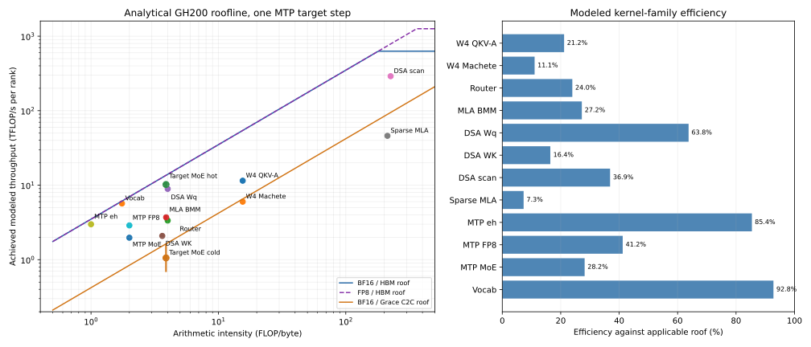

# MTP3 exact-400K forward-pass roofline

## Result

The profile is not dominated by the grafted MTP head. Per target step, the
four ranks average 30.32 ms of cumulative CUDA activity across overlapping
streams. Routed target MoE kernels account for 8.48 ms, custom all-reduce for
4.99 ms, and dense W4 target kernels for 5.53 ms. The explicitly identifiable
MTP FP8 block is only 0.49 ms; its three BF16 input projections add 0.15 ms.

The largest actionable losses are:

1. Hot HBM and cold Grace expert calls are serial for the size-4 verification
   batch. Ideal per-layer overlap has a 2.18 ms/step kernel-only upper bound.
2. Sparse MLA pads 16 real TP-local heads to 64 supported heads. Its measured
   efficiency is 7.30% against the applicable roof, but only about 1.83% of the
   roof produces useful, unpadded work.
3. The 4.99 ms attributed to 166 tiny all-reduces transfers only 23.5 MB per
   rank. Its 4.71 GB/s is not a bandwidth limit; it is primarily launch latency
   and waiting for unequal expert work.
4. Draft passes two and three repeat their full-context DSA scan and top-k
   instead of reusing pass one's index. The trace contains 24 indexer calls per
   step rather than 22.
5. All four vocabulary projections run close to the HBM roof. Avoiding three
   draft all-gathers with local argmax is useful, but tuning the GEMM itself is
   not.



## What is measured and what is modeled

This analysis uses eight steady decode target steps from each of four ranks at
399,744-token context. Each target step verifies four tokens and then runs
three serial batch-one MTP draft passes. Durations and launch shapes are from
PyTorch-profiler CUDA events.

The trace did not enable FLOP accounting, memory profiling, CUPTI performance
counters, or source stacks. FLOPs and minimum logical bytes are therefore
derived from the checkpoint tensor shapes, GLM-5.2 configuration, and vLLM
kernel contracts. They are not measured DRAM transactions. Cache effects,
compression metadata reuse, duplicate experts, and physical replay can change
actual traffic. Reported roof efficiencies are consequently analytical
estimates, while call counts and durations are observed.

The ceilings are the project's conservative GH200 values:

| Resource | Ceiling |
| --- | ---: |
| Hopper HBM | 3.5 TB/s |
| Hopper BF16 tensor cores | 630 TFLOP/s |
| Hopper FP8 tensor cores | 1,260 TFLOP/s |
| Measured Grace-to-Hopper C2C | 421 GB/s |
| One peer NVLink direction | 150 GB/s |

At these batch sizes nearly every weight GEMM is memory-bound. A row's
applicable roof is `min(compute ceiling, arithmetic intensity × bandwidth)`.

## One complete target step

```text
target verification, q=4
  embedding / TP reduction
  78 target transformer layers
    RMS -> W4 fused QKV-A -> W4 Q-B
    every fourth layer: DSA Wq -> K scan -> top-2048 selection
    sparse FP8 MLA over selected cache -> W4 O -> TP all-reduce
    RMS -> 256-way router
    routed W4 MoE: hot HBM experts, then cold Grace experts
    shared/dense W4 MLP on auxiliary stream -> TP all-reduce
  local BF16 vocabulary GEMM -> full-vocabulary NCCL all-gather

three serial MTP draft passes, q=1 each
  BF16 embedding/hidden projection -> TP all-reduce
  one FP8 draft block
    DSA indexer -> sparse FP8 MLA -> TP all-reduce
    FP8 shared+routed MoE -> TP all-reduce
  local BF16 vocabulary GEMM -> full-vocabulary NCCL all-gather

rejection sampling / next target batch construction
```

The trace confirms 78 target QKV-A calls, 312 target Machete calls, 300
routed-MoE Marlin calls, 81 sparse-MLA calls, 24 DSA scans/top-k operations,
166 custom all-reduces, and four vocabulary projections/all-gathers per step.
The 24 DSA calls are 21 target indexer layers plus all three MTP passes.

## CUDA activity inventory

Times below are cumulative kernel time divided by eight steps and averaged
over ranks. Work on different streams overlaps, so the rows do not sum to
end-to-end latency.

| Role | Calls or identifying kernels | Activity/step | Share of CUDA activity |
| --- | --- | ---: | ---: |
| Routed W4 target MoE | 300 Marlin | 8.476 ms | 28.0% |
| Target W4 linear | 78 Marlin + 312 Machete | 5.529 ms | 18.2% |
| Custom TP all-reduce | 166 one-stage | 4.989 ms | 16.5% |
| Elementwise and metadata | 358+ small launches | 2.344 ms | 7.7% |
| Routed-MoE support | sort, align, activation, sum | 2.040 ms | 6.7% |
| DSA indexer | projection, scan, top-k | 1.954 ms | 6.4% |
| Sparse MLA | split and combine | 1.953 ms | 6.4% |
| MLA BF16 contractions | 162 GEMMs | 0.657 ms | 2.2% |
| Vocabulary output | four GEMMs + NCCL | 0.653 ms | 2.2% |
| Sparse-MLA support | metadata and reductions | 0.506 ms | 1.7% |
| MTP FP8 block | 24 DeepGEMM launches | 0.487 ms | 1.6% |
| MoE router | 75 BF16 GEMMs | 0.281 ms | 0.9% |
| Memsets | 242 | 0.234 ms | 0.8% |
| MTP BF16 projection | three GEMMs | 0.152 ms | 0.5% |
| Explicit copies | 44 copies | 0.067 ms | 0.2% |

The complete 91-row grouped kernel/copy inventory, including exact kernel
names, grids, blocks, streams, per-rank spread, and launch occupancy reported
by the profiler, is in [roofline-kernels.csv](roofline-kernels.csv).

## Kernel roofline

| Kernel group | Time/step | AI (F/B) | Achieved | Effective BW | Roof efficiency |
| --- | ---: | ---: | ---: | ---: | ---: |
| Target fused QKV-A W4 Marlin | 0.876 ms | 15.52 | 11.49 TF/s | 740 GB/s | 21.16% |
| Target W4 Machete projections/MLPs | 4.653 ms | 15.52 | 6.01 TF/s | 387 GB/s | 11.06% |
| Target MoE router BF16 | 0.281 ms | 4.00 | 3.36 TF/s | 839 GB/s | 23.97% |
| MLA W_UK/W_UV BF16 | 0.657 ms | 3.89 | 3.71 TF/s | 953 GB/s | 27.22% |
| Target DSA Wq BF16 | 0.158 ms | 4.00 | 8.93 TF/s | 2.23 TB/s | 63.76% |
| DSA WK + score projection | 0.082 ms | 3.63 | 2.09 TF/s | 575 GB/s | 16.44% |
| DSA full-context FP8 scan | 0.981 ms | 224.97 | 290.52 TF/s | 1.29 TB/s | 36.90% |
| DSA cooperative top-k | 0.626 ms | n/a | n/a | 222 GB/s minimum | 6.35% byte roof |
| Sparse MLA FP8 split+combine | 1.953 ms | 212.29 | 46.01 TF/s | 217 GB/s | 7.30% |
| MTP `eh_proj` BF16 | 0.152 ms | 1.00 | 2.99 TF/s | 2.99 TB/s | 85.42% |
| MTP FP8 dense/index/shared | 0.140 ms | 2.00 | 2.88 TF/s | 1.44 TB/s | 41.21% |
| MTP FP8 routed experts | 0.230 ms | 2.00 | 1.97 TF/s | 987 GB/s | 28.19% |
| BF16 vocabulary projection | 0.586 ms | 1.75 | 5.68 TF/s | 3.25 TB/s | 92.80% |

The W4 GEMMs have low arithmetic intensity because weights are consumed by
only four target tokens. The large Machete group reaches only 11% of its
memory-bound roof, reflecting very small matrices and launch fragmentation.
The vocabulary GEMMs, despite also being memory-bound, are large contiguous
reads and reach 93% of the HBM roof.

The sparse-MLA kernel looks compute-heavy from its modeled padded work, but the
TP rank owns only 16 real query heads. The Hopper kernel supports 64 or 128
heads, so vLLM launches 64. Three quarters of the head work is padding. Its
46.0 TFLOP/s is 7.30% of the applicable BF16 roof; counting only useful model
heads gives about 1.83% useful efficiency. The gather over 2,048 sparse cache
positions further prevents streaming-bandwidth behavior.

## Routed MoE: HBM versus Grace

The target performs 600 expert-token assignments per rank per target step on
average. The trace has no routed expert IDs, so tier traffic is bounded. The
lower cold bound counts one distinct expert for every active cold layer; the
upper bound is the traffic that would saturate the measured 421 GB/s C2C
ceiling. Remaining assignments are attributed to HBM.

| Tier | Time/step | Assignment bound | Logical traffic | Effective BW | Roof efficiency |
| --- | ---: | ---: | ---: | ---: | ---: |
| Hot HBM | 3.911 ms | 501.3–558.6 | 9.76–10.87 GB | 2.49–2.78 TB/s | 71.3–79.4% |
| Cold Grace | 4.565 ms | 41.4–98.7 | 0.81–1.92 GB | 176–421 GB/s | 41.9–100% |

The cold range is intentionally broad: repeated assignments to the same
expert can reuse cache, while a physical counter would include transactions
not represented by logical tensor size.

More importantly, the current auxiliary tier stream is enabled only for query
sizes up to two. MTP verification uses four, so the hot and cold expert calls
serialize. Replaying the observed per-layer durations as perfect hot/cold
overlap gives this kernel-only bound:

| Rank | Serial route | Ideal overlap | Upper-bound saving |
| --- | ---: | ---: | ---: |
| 0 | 7.902 ms | 5.945 ms | 1.958 ms (24.8%) |
| 1 | 8.227 ms | 6.094 ms | 2.133 ms (25.9%) |
| 2 | 9.053 ms | 6.724 ms | 2.329 ms (25.7%) |
| 3 | 8.723 ms | 6.444 ms | 2.279 ms (26.1%) |
| Mean | 8.476 ms | 6.301 ms | 2.175 ms (25.7%) |

This is not a predicted TPOT improvement: dependencies, resource contention,
and cross-rank synchronization will reduce the realized end-to-end saving. It
is strong evidence that a minimal size-4 overlap experiment should come first.

Rank 2 spends 9.05 ms in routed kernels while rank 0 spends 7.90 ms. Across
ranks, routed time and all-reduce time have correlation `r=-0.988`: faster
ranks wait longer in collectives. Placement and route balance therefore affect
both the routed-MoE bar and the apparent communication bar.

## Communication and transfers

| Operation | Calls/step | Time/step | Payload/rank | Effective rate | Link efficiency |
| --- | ---: | ---: | ---: | ---: | ---: |
| Custom all-reduce | 166 | 4.989 ms | 23.48 MB remote | 4.71 GB/s | 3.14% |
| Vocabulary NCCL all-gather | 4 | 0.067 ms | 1.63 MB network | 24.16 GB/s | 16.10% |

The custom all-reduces are 157 target `[4, 6144]` reductions and nine draft
`[1, 6144]` reductions. Their measured microbenchmark latency floor totals
0.710 ms, only 14.2% of the 4.989 ms observed in the model. They are a sequence
of small synchronization points, not a link-bandwidth workload. Load balance
must be improved before interpreting their duration as a collective-kernel
problem.

Explicit profiler copy events are negligible relative to logical model data:

| Copy | Calls/step | Bytes/step | Time/step |
| --- | ---: | ---: | ---: |
| Pinned host to device | 24 | 25,261 B | 43.31 us |
| Device to device | 18 | 1,981,720 B | 19.62 us |
| Device to pinned host | 2 | 20 B | 3.93 us |

Those events mostly move metadata. Grace expert reads are direct UVA/C2C loads
inside Marlin and do not appear as memcpy events.

The modeled logical per-step traffic picture is about 18.08–19.20 GB from HBM
plus 0.81–1.92 GB from Grace C2C. HBM is dominated by hot routed weights
(9.76–10.87 GB), target non-routed W4 weights (2.45 GB), the vocabulary head
(1.90 GB), and DSA K scans (1.27 GB). Peer collectives move about 25.1 MB per
rank but impose many synchronization boundaries.

## Optimization order from this trace

1. Extend the already-existing hot/cold stream overlap to the uniform size-4
   verification shape, then measure correctness, HBM headroom, TPOT, and route
   time. The trace-derived kernel upper bound is 2.18 ms/step.
2. Add or select a sparse-MLA decode path that natively supports 16 TP-local
   heads. This removes 75% padded head work before more subtle tuning.
3. Capture MTP-aware routes and rebuild owner/hot placement. Re-profile before
   changing the all-reduce backend because current collective time contains
   expert-imbalance wait.
4. Make DSA index sharing graph-safe so draft passes two and three reuse the
   first draft's indices, eliminating two full-context scans and top-k paths.
5. Use a local-argmax reduction for greedy draft tokens to remove three
   full-vocabulary all-gathers. The local vocabulary GEMM is already at 92.8%
   of its roof and is not a kernel-tuning target.

The MTP FP8 compute path should remain unchanged until these larger target-path
losses are addressed.

## Reproduction and artifacts

```bash
source agent_space/jupiter-env.sh
.venv/bin/python \
  agent_space/experiments/2026-07-18-mtp-prompt-profile/analyze-roofline.py \
  /e/scratch/profound/naeimitabiei1/glm52-mtp-profile-968182 \
  agent_space/experiments/2026-07-18-mtp-prompt-profile
```

- [roofline.svg](roofline.svg) and [roofline.png](roofline.png): plotted roofs
  and efficiency bars
- [roofline-summary.json](roofline-summary.json): machine-readable modeled
  rows, tier bounds, communication, and exact assumptions
- [roofline-kernels.csv](roofline-kernels.csv): every grouped kernel, copy, and
  memset observed in the trace
- [analyze-roofline.py](analyze-roofline.py): dependency-light analyzer
