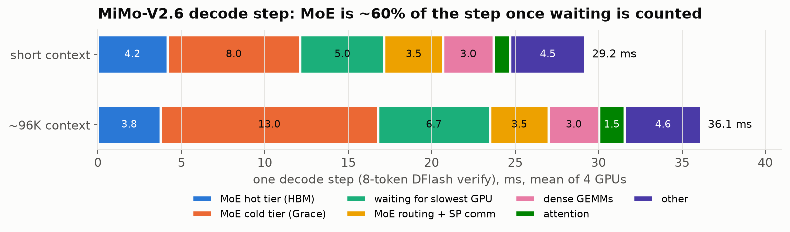
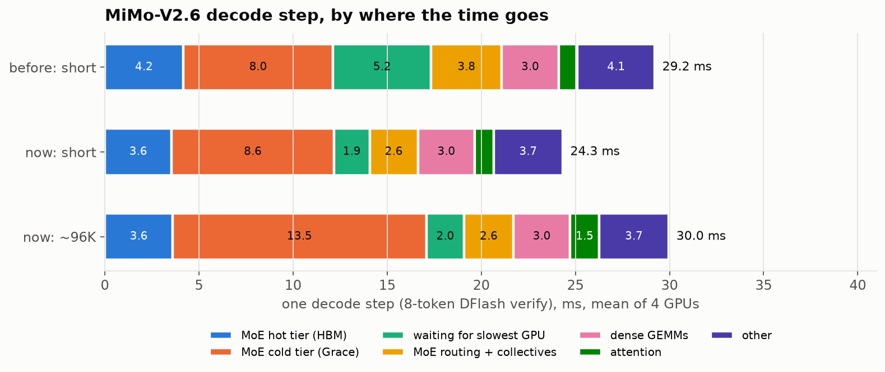
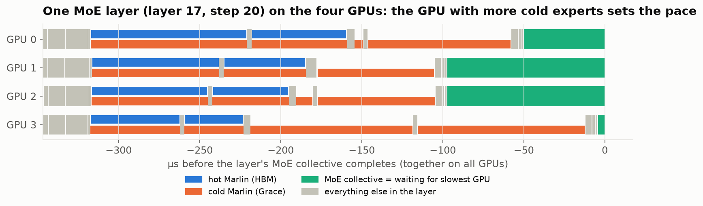
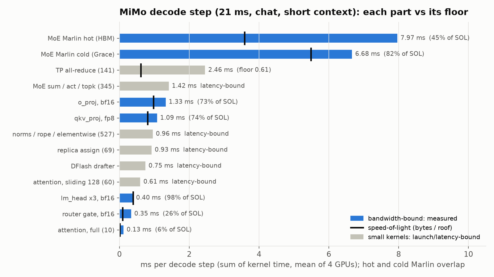
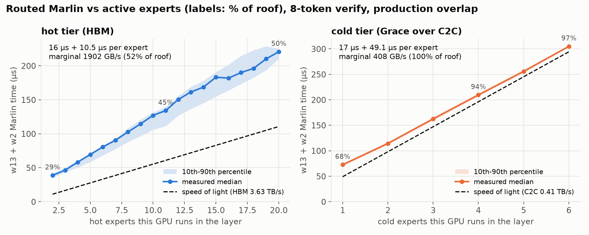

# MiMo-V2.6 decode profile (2026-09-26)

Where a decode step goes in the production MiMo config: tiered MoE with the
routing profile (`profile-3827.json`), DFlash k=7, R3, LM-only, TP4/EP4, c=1.
Job **2074303**; traces in
`/e/project1/profound/alint77/traces/mimo26-decode-2074303/{decode-short,decode-96k}`.

## Capture

`capture.py` reuses the 2026-09-04 harness's gating (the window opens only once
generation tokens are rising). Each context gets one long greedy request; its
step time is measured **unprofiled** from the metrics counters first, then a 2 s
profiler window is opened on the same request.

| | unprofiled step | profiled step | distortion | tokens/step |
| --- | ---: | ---: | ---: | ---: |
| short (PyTorch coding prompt) | 28.61 ms | 29.48 ms | +3.0% | 5.2 |
| ~96K (Claude-Code-shaped) | 34.82 ms | 36.46 ms | +4.7% | **8.0** |

Distortion is small, so absolutes are quotable. **The 96K request degenerated:**
8.0 tokens per step means every draft was accepted, i.e. greedy output was
looping. Step cost is unaffected (the verify is always 8 tokens), but its
routing is not representative traffic, so read the 96K row for attention
scaling only.

## Method

`analyze.py`: kernels are attributed to a step by launch correlation. Each step
is one big verify graph (~2.3K kernels), lm_head + vocab all-gather, the DFlash
drafter (6 small graphs + eager attention), and host-side kernels. Time inside
the verify graph is union-partitioned (each instant shared among the categories
active in it), so shares sum to busy time and the hot/cold overlap is not double
counted. Hot vs cold Marlin by grid: 264 CTAs (hot, 2/SM) vs 132 (cold, 1/SM).
Collectives are also compared across ranks per (step, ordinal): the cross-rank
minimum approximates the transfer, the excess is waiting.

## Result (short context, 29.2 ms/step, mean of 4 GPUs)

| | ms/step | share |
| --- | ---: | ---: |
| MoE Marlin, hot tier (HBM) | 4.16 | 14% |
| MoE Marlin, cold tier (Grace) | 7.96 | 27% |
| **waiting in reduce-scatter for the slowest GPU** | **5.05** | **17%** |
| MoE routing/align/act/sum | 1.50 | 5% |
| SP MoE comm: all-gather 1.56 + reduce-scatter transfer 0.46 | 2.02 | 7% |
| dense GEMMs (fp8 deep_gemm + cuBLAS) | 3.02 | 10% |
| attention (FA3/FA4 with sinks, KV write) | 1.01 | 3% |
| norms, rope, elementwise | 0.93 | 3% |
| TP custom all-reduce | 0.40 | 1% |
| drafter 0.87 + logits 0.28 + host kernels 0.20 | 1.35 | 5% |
| GPU idle within the step | 1.82 | 6% |

Findings:

1. **The "communication" is load imbalance.** MiMo's MoE runs sequence-parallel
   (69 reduce-scatters + 138 all-gathers per step). The reduce-scatter costs 5.51
   ms/step but its cross-rank minimum is 0.46 ms: 5.05 ms is ranks waiting.
   `imbalance.py` pins it: each rank's waiting equals the slowest rank's Marlin
   time minus its own in that layer (5.05 vs 4.99 ms/step, all four ranks within
   0.06 ms). The per-layer spread is mostly cold (5.8 ms/step) not hot (2.2), and
   the last rank to arrive is uniform (23-26% each): per-step routing variance,
   not a slow GPU.

   

2. **MoE is ~60% of the step once waiting is counted**: 12.1 ms of overlapped
   Marlin plus 5.0 ms of waiting. The hot/cold overlap is doing its job: Marlin
   sums to 18.7 ms/step, its union is 12.5 ms.
3. **Cold is still the long pole.** Even with the profile (17% of expert reads
   from Grace), cold Marlin sums to 11.3 ms/step against 7.4 hot: ~87 µs per
   cold expert-layer vs ~11.5 µs hot, the C2C/HBM ratio. Per layer the cold tier
   finishes last on average.
4. Attention is cheap and scales gently (1.0 -> 1.5 ms from short to 96K): 60 of
   70 layers are 128-token sliding window.
5. 1.8 ms/step of GPU idle sits between the verify graph and the drafter
   (rejection sampling needs the host).

## Levers, in order of size

| lever | addresses | size |
| --- | --- | --- |
| balance cold work across GPUs per layer: replica assignment (GLM's exact min-max with secondary Grace copies), not yet built for MiMo | waiting 5.05 ms | up to ~17%; GLM got 5-8% from it |
| less cold work: more residency (reserve, KV) or per-layer slot allocation weighted by cold cost | cold 8.0 ms | each cold expert-layer removed ~76 µs |
| drop sequence-parallel MoE for the all-reduce path GLM uses (Phase 8) | SP comm ~2.0 ms | ~1.6 ms (~5%); waiting would move to the all-reduce, not vanish |
| overlap draft/sampling with the next verify | idle 1.8 ms | ~6% |

Replica assignment is the first thing to try: it targets the largest bucket and
the machinery exists (`2026-07-31-replicated-expert-scheduling/oracle.py`,
`--tiered-moe-replica-assignment exact`), but it needs a MiMo profile v2 with
`secondary_ranks` and the per-step route fingerprint check under DFlash.

## Files

`capture.py`, `job.sbatch` (capture); `analyze.py` -> `breakdown-2074303.{txt,json}`;
`imbalance.py` -> `imbalance-2074303.txt`; `plot_breakdown.py` -> `figs/`.

## Re-profile after the fixes (job 2077034)

Production config now: routing profile + 1500 replicas/rank, exact replica
assignment, no sequence-parallel MoE (`serve.sbatch` defaults). Both requests
now **sample** (temperature 1.0, top-p 0.95, the model's defaults, as Claude
Code traffic does) instead of greedy, so the 96K request no longer loops
(5.7 tokens/step). Profiler distortion +5.6% short, +10.8% at 96K.

| ms/step, mean of 4 GPUs | before (short) | now (short) | now (~96K) |
| --- | ---: | ---: | ---: |
| step (profiled) | 29.21 | **24.33** | 29.96 |
| MoE hot tier | 4.16 | 3.56 | 3.61 |
| MoE cold tier | 7.96 | 8.61 | 13.47 |
| **waiting for slowest GPU** | **5.21** | **1.90** | 2.02 |
| MoE routing/assign + collectives (transfer) | 3.75 | 2.56 | 2.60 |
| dense GEMMs | 3.02 | 3.02 | 3.03 |
| attention | 1.01 | 1.01 | 1.53 |
| other (norms, drafter, logits, sampling, idle) | 4.10 | 3.67 | 3.70 |

Findings:

1. **Waiting fell 5.2 -> 1.9 ms/step (-63%).** Cold-tier spread across GPUs
   5.8 -> 1.9 ms/step; the replicas did their job. **Hot-tier spread is
   unchanged (2.2 -> 2.1)** and is now the larger part: replicas only move cold
   work. GPU 3 is last to arrive 32-37% of layers (was uniform ~25%): it holds
   the most hot experts (3867 vs 3763), so its hot Marlin runs longest.
   
2. **SP collectives are gone.** The only collectives left are 141 custom
   all-reduces/step: 0.61 ms of transfer (was 2.4 ms with SP RS/AG + AR). MoE
   routing kernels rose 1.50 -> 1.95 ms (the replica assign kernel, and the gate
   now runs on all 8 tokens rather than a 2-token chunk).
3. **The cold tier is the critical path in every layer**: cold sums to
   11.95 ms/step against 6.76 hot; overlapped union 12.48.
4. **Long context costs cold work, not attention.** At ~96K (sampled, not
   looping) cold rises 8.6 -> 13.5 ms/step while attention rises only 1.0 ->
   1.5. The first capture's 96K cold increase was blamed on the greedy loop;
   it persists without one, so decoding over a long code context routes to
   experts the profile (trained on shorter agentic turns) left cold. Needs a
   routing capture at long context to confirm and fold into the profile.
5. **Sampling costs ~0.55 ms/step** (top-p softmax + radix sort + scan, and the
   rejection sampler's recovered tokens), invisible in greedy benchmarks.

Levers now:

| lever | addresses | size |
| --- | --- | --- |
| profile trained on long-context traffic too | cold 13.5 ms at 96K | large at long context |
| balance hot work too (hot residency spread per layer, or hot replicas) | hot spread ~2.1 ms | up to ~2 ms |
| fewer cold experts per layer (more residency; skip staging replicas in prefill: +44 hot slots) | cold 8.6 ms | per cold expert-layer |
| FlashInfer top-p sampling instead of torch sort | sampling ~0.55 ms | ~2% |

## Speed-of-light analysis (job 2077518, chat endpoint, routes recorded)

Capture with `--enable-return-routed-experts`, requests sent through
`/v1/chat/completions` (the route writer is only wired into the chat
endpoint; job 2077288 used `/v1/completions` and recorded no routes).

**Correction to the re-profile above.** Through the chat endpoint the same
two prompts step at 21.0 ms (short) and 22.9 ms (~96K), cold tier 3.8 / 5.7
ms/step, against 24.3 / 30.0 and 8.6 / 13.5 through `/v1/completions`. The
profile was trained on chat traffic; raw-completion continuation routes to
experts it left cold. The "long context drives cold work" finding was mostly
this endpoint/content effect; at ~96K cold still rises 3.8 -> 5.7 ms.

### Whole step (`sol.py`, bytes from the checkpoint's shapes, HBM 3.63 TB/s)

| part | ms/step | per call | vs floor |
| --- | ---: | ---: | --- |
| MoE Marlin hot (HBM), 9.4 experts/layer/GPU | 7.97 | | **45% of SOL** |
| MoE Marlin cold (Grace), 1.6 experts/layer/GPU | 6.68 | | 82% of SOL (C2C) |
| TP all-reduce x141 | 2.46 | 17.5 us | floor 0.61 (cross-rank min): the rest is waiting |
| MoE sum / act / topk x345 | 1.42 | 4.1 us | latency-bound |
| o_proj, **bf16** 50.3 MB | 1.33 | 19.1 us | 73% (2.64 TB/s) |
| qkv_proj, fp8 41.7 MB | 1.09 | 15.5 us | 74% (2.68 TB/s) |
| norms / rope / elementwise x527 | 0.96 | 1.8 us | latency-bound |
| replica assign x69 | 0.93 | 13.5 us | latency-bound, one CTA |
| DFlash drafter (excl. lm_head) | 0.75 | | latency-bound |
| attention, sliding 128 x60 | 0.61 | 10.1 us | latency-bound (0.2 MB each) |
| lm_head x3, bf16 469 MB | 0.40 | 132 us | 98% |
| router gate, bf16 4.7 MB | 0.35 | 5.0 us | 26% |
| attention, full x10 | 0.13 short, 0.64 at 96K | 12.6 / 63.9 us | 54% at 96K (1.95 TB/s) |

### Marlin by active experts (`marlin_by_count.py`)

Routes joined to the trace per (step, layer, GPU); each GPU's cold experts
come from replaying the production `tiered_moe_assign_align` op. Alignment
correlation 0.992 (short) / 0.996 (96K); tight per-count bands.

- **Cold (Grace): 17-20 us + 48-49 us per expert, marginal 408-421 GB/s = the
  C2C roof.** 68% of roof at 1 expert (the fixed cost), 86% at 2, 91% at 3,
  94-99% at 4+. Nothing left in the kernel; only fewer cold experts help.
- **Hot (HBM): ~16 us + 10.5-10.9 us per expert, marginal ~1.9 TB/s = 52% of
  HBM.** 43% at the typical 8-9 experts, never above ~52%. This is measured
  in production overlap (co-resident with cold), with the launch policy
  (hot 2 CTAs/SM, cold 1) tuned on GLM int4, never re-tuned for mxfp4.

### What it means

On chat traffic the hot tier is now the longer one (8.0 vs 6.7 ms/step
summed; ~9.4 hot vs ~1.6 cold experts per layer), so **hot Marlin efficiency
is the top lever**: at 45% of SOL it holds ~4.4 ms/step above its floor.
Next: sweep the hot tier's CTAs/SM for mxfp4 (smem is 27 KB/CTA, so 3-4 hot
+ 1 cold fit), then look at the mxfp4 Marlin tile config at M=8. Smaller
items: the replica assign kernel (0.93 ms, single CTA), o_proj in bf16
(0.36 ms above an fp8 floor if quantized; accuracy question), router gate
(26%).
