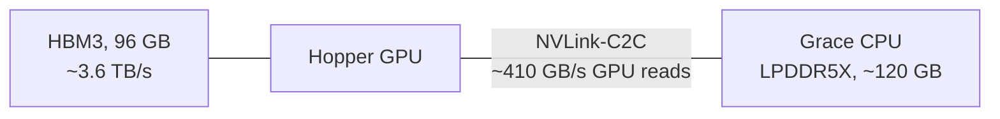

# Hot/cold MoE expert offloading on GH200

How we serve MoE models that don't fit in HBM on a 4x GH200 node with vLLM: keep
the experts that actually get used in HBM, leave the rest in Grace memory, and
read them in place. Numbers are from MiMo-V2.6-Pro (and GLM-5.3 where noted),
TP4/EP4, one node. Where a result is GLM's rather than MiMo's, it says so.

**TL;DR**

- Stock vLLM offload decides *which* weights leave HBM by position in the model.
  For MoE that's the wrong axis: what matters is how often an expert is routed to.
- We split every MoE layer per expert: popular experts in HBM, the rest in Grace,
  both tiers running concurrently in one layer.
- Choosing the hot set from real routing traces cut MiMo's decode step time by
  **28%** (34.7 → 25.0 ms), with prefill unchanged.

## The hardware

Each GH200 pairs a Hopper GPU with a Grace CPU over NVLink-C2C, and the GPU can
dereference Grace memory directly (UVA): no copy, no page fault. So you get
~120 GB of extra memory that a kernel can read at ~410 GB/s, about 1/9 of HBM.
Those are our measurements, not spec sheet numbers.

That 1/9 decides everything. Memory the GPU reads from Grace is fine only if not
much gets read from it per step.

## The problem

MiMo-V2.6-Pro at EP4 puts 69 MoE layers x 96 experts = 6,624 experts on each GPU,
**123.7 GiB** of expert weights (mxfp4, 19.1 MiB each). HBM is 95 GiB and also has
to hold attention weights, a 250K-token KV cache and a speculative drafter. So
roughly 40% of the experts have to live in Grace.

MoE is what makes this workable. Each token uses 8 of 384 experts per layer, and
routing is skewed: some experts get picked ~8x more often than a uniform share, and
the bottom ~50 are almost never picked.

Put the most-used half of each layer in HBM and ~80% of routed tokens never touch
Grace. Put an arbitrary half there and it's 50%. This curve is measured on task
types the ranking never saw.

## Why stock vLLM offload doesn't cut it

`--cpu-offload-gb N` walks the model's modules in order and moves parameters to
pinned host memory until it has moved N GB. The GPU then reads them in place
through UVA. On GH200 that's the right mechanism with the wrong policy:

- **It offloads by position, not by use.** The first layers' experts go to Grace
  in full, including their busiest experts, and the rest stay in HBM in full,
  including experts that are almost never routed to.
- **A layer lives in exactly one tier.** While a Grace-resident layer runs, HBM
  bandwidth sits idle, and vice versa. You pay the slow link on those layers
  instead of adding its bandwidth to HBM's.
- **Sharp edges we hit:**
  - It is silently ignored under the V2 model runner: 60 and 105 GB OOMed at the
    same resident size.
  - `pin_memory()` goes through PyTorch's caching host allocator, which rounds
    each allocation up to a power of two. A 1.01 GiB tensor pins 2 GiB.
  - Pinned pages land on whichever NUMA node the thread happens to run on. A
    non-local node drops C2C reads from ~410 to 70–80 GB/s, and nothing errors;
    it's just slow.

The prefetch offloader goes the other way: it copies whole layers into HBM ahead
of use, whole parameter tensors at a time. For MoE decode that moves all 96
experts a GPU owns in a layer to use the ~11 a step actually touches, and the
staging buffers eat HBM that could hold experts.

## What we built

**Per-expert tiers.** Each MoE layer's experts are split into a hot set in HBM
and a cold set in Grace. The cold set is pinned at its exact size
(`cudaHostRegister`, no rounding) on the GPU-local NUMA node. A planner counts
every byte on the GPU (weights, KV cache, workspaces, CUDA graphs, a reserve), and
whatever HBM is left becomes hot slots. Free memory after warmup matches the plan
to ~0.05 GiB.

**Both tiers run at once.** One router call, then two Marlin launches per layer:
hot on the main stream, cold on a side stream. On its own this didn't overlap at
all. Marlin requests all of an SM's shared memory per CTA, about 3x what it uses,
so the second kernel could never be scheduled next to the first. Requesting only
what it uses lets both tiers share every SM, so a layer costs
`max(hot, cold)` instead of `hot + cold`: −31 to −45% MoE time at the kernel
level, −5 to −8% end-to-end step time on GLM. HBM streaming (3.1 TB/s) and C2C
(331 GB/s) running together showed no slowdown on either side. The cold kernel
reaches 88–95% of the C2C link on its own.

**Hot set chosen from real traffic.** We record which experts the router picks on
real agentic-coding sessions, then fill the hot slots with the most-used experts.
That's the step that moved MiMo from 42% to 15% of routed tokens hitting Grace.

The right panel is the one that sets the cost. A kernel reads each distinct expert
once per step, however many tokens use it, so per-step reads are what cross the
link.

**Prefill stages instead of reading in place.** With 8K tokens per chunk every
expert gets hit many times, and GPU L2 doesn't cache host memory, so reading in
place re-streams the same cold weights once per token block. During prefill we
copy the next layer's cold experts into an HBM staging slot while the current
layer computes.

## Results

MiMo-V2.6-Pro, 250K context, batch one, DFlash speculative decoding (8 tokens
verified per step). The A/B varies only which experts are hot; the server is
restarted per run and both orders are used on three nodes. The decode prompts
were not in the routing capture.

| | arbitrary hot set | routing profile |
| --- | ---: | ---: |
| routed tokens served from Grace | 42% | **15%** |
| experts read from Grace per step | 42% | **17%** |
| decode step time | 34.7 ms | **25.0 ms (−28%)** |
| decode speed | ~110 tok/s | **~147 tok/s** |
| TTFT at 32K / 128K / 240K | 4.0 / 16.9 / 40.2 s | 4.0 / 16.7 / 39.8 s |
| GSM8K (400 questions, greedy) | 90.2% | 90.0% |

Every run landed within 0.3 ms of its arm's mean.

What each piece bought, each against its own control:

| change | effect |
| --- | --- |
| hot/cold overlap (shared-memory fix) | −5 to −8% decode step (GLM) |
| hot set from a routing profile | −28% decode step (MiMo) |
| prefill staging of cold experts | −17 to −23% TTFT (MiMo) |
| cross-GPU copies of busy cold experts | −5 to −6.5% step at 4 concurrent requests (GLM) |

## Things worth knowing

- **Offloading barely matters until a step touches many experts.** At one token per
  step, the HBM kernel is latency-bound (~10% of HBM bandwidth), and Grace-resident
  experts ran within a few percent of HBM ones. With speculative decoding or
  batching, a step touches ~45 of 384 experts per layer, the kernels become
  bandwidth-bound and the 9x gap shows. That's also when placement starts paying.
- **The sweet spot is ~15% of bytes from Grace.** The profile lands MiMo at 17%.
  That's about where both links finish their share of a step at the same time:
  `B_c2c / (B_c2c + B_hbm_achieved)` = 410 / (410 + ~2,150 GB/s).
  Past that point, Grace is the bottleneck.
- **Don't cap the cold tier's SMs.** Limiting how many SMs read host memory is a
  common way to avoid congestion. With Marlin, 8 SMs made the cold tier 2.5x
  slower than 32 did. It needs many SMs to keep enough reads in flight, and
  it never overloads the link.
- **The profile is trained on coding traffic.** It holds up on coding task types
  it never saw (15% vs 12% in-sample), but chat, math or other languages may route
  differently and are untested.
