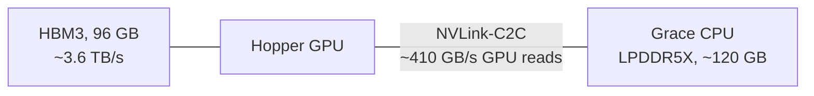

# Tiered MoE on GH200: serving models bigger than HBM

How we serve MoE models that don't fit in HBM on one 4x GH200 node with vLLM.
Keep the experts that actually get used in HBM, leave the rest in Grace memory,
and have the GPU read **both tiers at the same time**. Making them overlap was
the core of the work; everything else builds on it.

**TL;DR**

- GH200's GPU can read Grace memory in place at ~410 GB/s, 1/9 of HBM. That makes
  Grace usable for weights, but only if Grace reads hide *under* HBM reads instead
  of adding to them.
- We split every MoE layer per expert into a hot tier (HBM) and a cold tier
  (Grace) and run both at once. That took fixing a Marlin launch detail that
  silently serialized the two kernels.
- GLM-5.2 (361 GiB) at 400K context: stock vLLM offload decodes at **38 tok/s**,
  our stack at **128 tok/s**. Overlap is +18% of that on its own, plus another
  −8% step time from the Marlin fix.
- On MiMo-V2.6, picking the hot set from real routing traces and then balancing
  the cold work across GPUs took decode from **110 to 178 tok/s** (34.7 → 20.7 ms
  per step), with prefill and accuracy unchanged.

## The hardware

A GPU kernel can dereference Grace memory directly (UVA): no copy, no page fault.
That's ~120 GB more per GPU at 1/9 of HBM speed. All numbers here are measured
on our node, not spec sheets.

## The problem

- **GLM-5.2 W4A16** is 361 GiB of weights against 4 x 96 GiB of HBM on the node, before
  any KV cache.
- **MiMo-V2.6-Pro** has 6,624 experts per GPU at EP4: 123.7 GiB of expert weights
  for 95 GiB of HBM that also holds attention weights, a 250K-token KV cache and a
  speculative drafter.

So 35–50% of experts have to live in Grace, depending on model and context. MoE makes that workable, because a
step only touches a few experts per layer. The question is what the Grace part
costs.

## What stock vLLM does

`--cpu-offload-gb N` moves parameters to pinned host memory, in model order, until
it has moved N GB. The GPU then reads them in place through UVA. On GH200 that's
the right mechanism with the wrong shape:

- **Whole layers go to Grace.** Busy and idle experts are treated the same.
- **A layer lives in exactly one tier.** While a Grace-resident layer runs, HBM
  sits idle, and vice versa. Grace time is *added* to the step, never hidden.
- **Sharp edges:**
  - The flag is silently ignored under the V2 model runner.
  - `pin_memory()` rounds every allocation up to a power of two, so a 1.01 GiB
    tensor pins 2 GiB.
  - Pinned pages land on whatever NUMA node the thread is on. The wrong node
    drops C2C from ~410 to 70–80 GB/s, and nothing errors.

## The idea: two tiers, read at the same time

Split each MoE layer's experts into **hot** (HBM) and **cold** (Grace). After
routing, launch one Marlin kernel over the hot experts and one over the cold
experts, on two streams, so the layer costs `max(hot, cold)` instead of
`hot + cold`.

If the tiers run one after the other, every byte from Grace costs 9x a byte from
HBM, and offloading is pure loss. If they overlap, Grace reads hide under HBM
reads until both take equally long, which happens at ~16% of a step's bytes from
Grace. Up to there, offloading is close to free.

## Making the overlap real

**The first version didn't overlap.** It had per-expert tiers, two launches and
two streams, and still decoded at stock-offload speed (37 vs 38 tok/s): the tiers
ran effectively back to back. Enabling the overlap for the 4-token MTP verify
batches brought +18% (108 → 128 tok/s). Profiling then showed the kernels still
barely overlapped: 103 µs together against 113 µs one after the other.

**The cause was Marlin's shared-memory request.** Marlin sizes its launch to
carve each SM into exactly N CTAs, so it asks for `228 KiB / N` of shared memory
per CTA regardless of what it uses. It uses ~25 KiB. At 3 CTAs per SM, the hot
kernel claims 224 of 228 KiB on every SM, and the cold kernel's CTAs can't be
placed anywhere until hot CTAs retire.

**The fix:** request the shared memory the kernel actually indexes, and size the
grid explicitly: hot at 2 CTAs per SM, cold at 1, both spread over all 132 SMs.
Now CTAs from both tiers sit on the same SMs, one kernel pulling from HBM and the
other from Grace.

Across 15 realistic hot/cold mixes, one layer gets 15–40% faster (median −34%),
and most land within a few µs of `max(hot, cold)`. End to end on GLM, same node,
acceptance-adjusted: **−7.7% step time, +7% tok/s**, and +6% on long agentic
prompts. Three things we checked along the way:

- **HBM and C2C traffic don't fight.** 3.0 TB/s from HBM and 410 GB/s over C2C,
  co-resident, finished within 0.1% of the slower one alone.
- **The cold kernel saturates the link.** Cold Marlin reaches 88–95% of C2C.
- **Partitioning SMs is worse.** Green contexts, which give each tier its own
  SMs, were 9–40% slower. With 8 SMs the cold tier is 2.5x slower than with 32:
  it needs many SMs to keep enough reads in flight.

Blue bars are offload work; grey bars are a MoE communication fix and MTP
speculative decoding.

## Making it production-grade

- **Exact memory planning.** A planner counts every byte on the GPU: weights, KV
  cache, workspaces, CUDA graphs and a reserve. Whatever is left becomes hot
  expert slots. Free HBM after warmup matches the plan to ~0.05 GiB.
- **Load straight to the final tier.** Each expert is converted to Marlin layout
  one at a time and written directly to HBM or Grace. The cold tier is pinned at
  exact size (`cudaHostRegister`, no rounding) on the GPU-local NUMA node.

## Choosing what's hot

Once the tiers overlap, the goal is to keep the cold tier's share of each step
near the ~16% balance point. Routing is skewed: some experts get ~8x a uniform
share, and the bottom ~50 per layer are almost never picked. So we record which
experts the router picks on real agentic-coding sessions, and fill the hot slots
with the most-used ones.

Measured on task types the ranking never saw: with the most-used half in HBM,
80% of routed tokens never touch Grace. With an arbitrary half it's 50%.

MiMo had been running with an arbitrary hot set: 42% of each step's expert reads
came from Grace, far past the balance point. With the profile it's 17%.

MiMo-V2.6-Pro, 250K context, batch one, DFlash speculative decoding (8 tokens
verified per step). Only the hot set changes; servers are restarted per run, in
both orders, on three nodes. The decode prompts weren't in the capture. Every
run landed within 0.3 ms of its arm's mean, and GSM8K didn't move.

## What's left: GPUs waiting on each other

A profiler trace of MiMo decode (29.2 ms per step) puts the MoE at ~60% of the
step: 12 ms of expert kernels and 5 ms of GPUs waiting for each other.

This is one real MoE layer on the four GPUs of the node. Each GPU owns a quarter
of the layer's experts and runs its own hot (blue) and cold (orange) Marlin, then
all four meet in a reduce-scatter (green) before the next layer can start. The
collective can only finish once the last GPU arrives.
- GPUs 1 and 2 drew a lot of cold, Grace-resident work in this layer.
- GPU 3 drew almost none, so it sits ~150 µs in the collective doing nothing, and
  so does GPU 0.

Over a whole step, that collective looks like 5.5 ms of communication. Only
0.46 ms of it is data moving. The rest matches, to within 0.06 ms per GPU, the
slowest GPU's extra Marlin time in each layer. Which GPU arrives last changes
from layer to layer (each is last ~25% of the time), so this is routing
variance, not a slow GPU.

## Balancing the GPUs: replicas

The fix is to let a busy GPU hand cold work to a less busy one. That took two
changes.

**Every GPU must see the same routing.** MiMo's MoE ran sequence-parallel: each
GPU routed only its share of the tokens, then the GPUs swapped results with a
reduce-scatter and two all-gathers per layer. Tiered GLM already skips this and
has every GPU route all tokens, ending the layer in one all-reduce. Doing the
same on MiMo cut the step by 13% (25.0 → 21.8 ms) on its own. It also means
every GPU makes the identical routing decision for every token, which the next
part relies on.

**Spare copies of busy experts.** Each GPU keeps copies of some of the other
GPUs' cold experts in its own Grace memory: 1,500 copies, 28 GiB per GPU, out of
~45 GiB we measured free. At every layer, a small kernel looks at which cold
experts are active and decides which copy runs, so that the busiest GPU gets as
few cold experts as possible. All GPUs run that decision on the same routes, so
they agree without talking to each other.

Here GPU 0 drew 5 of the layer's 11 active cold experts. With copies, GPU 1 and
GPU 3 each run one of them from their own Grace memory, and the layer waits for
3 cold experts instead of 5.

Which experts to copy is chosen offline from the routing traces: on held-out
steps, 1,500 copies per GPU cut the busiest GPU's cold work from 225 to 165
expert-layers per step, and more copies barely help. Measured: **21.9 →
20.7 ms per step (−5.3%)**, 6 runs each, and every run with copies beat every
run without. A check that all GPUs agreed on every route passed, and GSM8K was
unchanged.

It's less than the replay suggested: with only 1–3 cold experts per GPU, cold
time isn't proportional to count, and copies don't touch hot-tier imbalance.

## End result on MiMo

MiMo-V2.6-Pro on one 4x GH200 node, 250K context, batch one, DFlash speculative
decoding. Every column is measured with the servers restarted per run.

| | arbitrary hot set | + routing profile | + no SP-MoE | + replicas |
| --- | ---: | ---: | ---: | ---: |
| decode step | 34.7 ms | 25.0 ms | 21.8 ms | **20.7 ms** |
| decode speed | ~110 tok/s | ~147 tok/s | ~165 tok/s | **~178 tok/s** |
| TTFT 32K / 128K / 240K | 4.0 / 16.9 / 40.2 s | 4.0 / 16.7 / 39.8 s | 4.0 / 16.6 / 39.6 s | 4.0 / 16.9 / 40.2 s |
| GSM8K 400 (per run) | 90.2, 91.5% | 90.7, 90.0% | 89.7–91.0% | 91.0% |

Prefill is flat throughout. The copies cost ~1.5% at 128K+ because prefill still
stages them into HBM even though only decode uses them; that's a small fix left
to do.

## Prefill is different

A prefill chunk is 8K tokens, so every cold expert gets hit many times. GPU L2
doesn't cache host memory, so Marlin re-streams the same cold weights over C2C
for every token block. In prefill we instead copy the next layer's cold experts
into an HBM staging slot while the current layer computes: **−17 to −23% TTFT**
on MiMo. Decode keeps reading in place.

## What each piece bought

Each result is against its own matched control.

| change | effect |
| --- | --- |
| hot/cold overlap on two streams (MTP3 verify) | +18% decode tok/s (GLM) |
| Marlin shared-memory fix, tiers truly co-resident | −34% per MoE layer, −7.7% step (GLM) |
| hot set from routing traces | −28% decode step (MiMo) |
| every GPU routes all tokens (no sequence-parallel MoE) | −13% decode step (MiMo) |
| cross-GPU copies of busy cold experts | −5.3% step (MiMo, batch one); −5 to −6.5% at 4 concurrent requests (GLM) |
| staging cold experts in prefill | −17 to −23% TTFT (MiMo) |

## Things worth knowing

- **Offloading barely matters at one token per step.** There, HBM-resident Marlin
  is latency-bound (~10% of HBM bandwidth), and Grace-resident experts ran within
  a few percent of it. With speculative decoding or batching, a step touches ~45 of
  384 experts per layer, kernels turn bandwidth-bound and the 9x gap shows. That's
  when both overlap and placement start paying.
- **Measure under CUDA graphs.** Timing the fork/join eagerly added ~110 µs of
  stream barriers per iteration. That hid the whole overlap win and made the fix
  look worthless at low expert counts.
- **Profiles are traffic-specific.** Ours is trained on coding. It holds up on
  coding task types it never saw (15% vs 12% of routes to Grace in-sample), but
  chat, math or other languages are untested.
